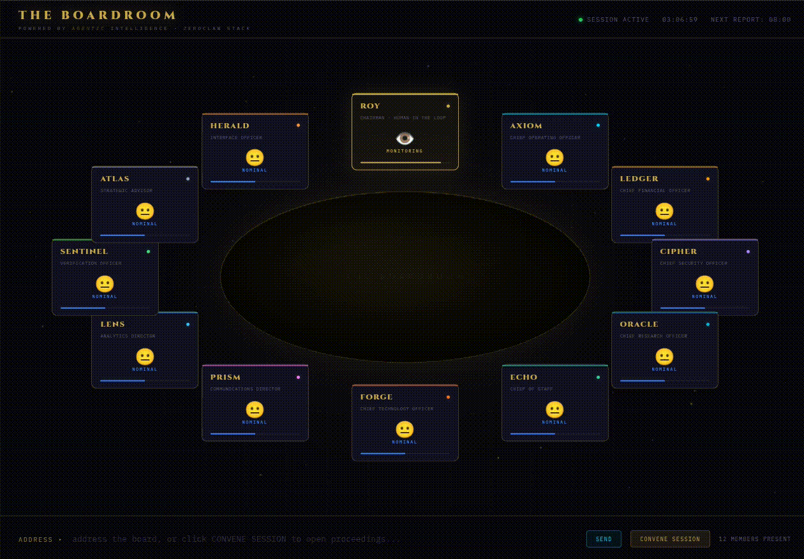

# 🏛️ Digital Boardroom

An immersive, spatial governance dashboard built for the next generation of board meetings.

## 👁️ Visual Demo

### 3D Council Arc (Priority Focus)

### 2D Interactive Dashboard

## 🎯 Vision

The Digital Boardroom is a synthesis of immersive 3D spatial computing and real-time agentic intelligence. 
While we maintain a high-fidelity 2D interface, our priority is the **3D Council Arc**, designed to be:

- **Engaging & Immersive:** Transcending the limitations of traditional 2D video conferencing.
- **Mobile & XR Ready:** Optimized for headsets and mobile users, moving away from desktop-only paradigms.
- **Future-Proof:** Built on A-Frame with a trajectory towards advanced spatial frameworks like `xrblocks`.

## 🛠️ Stack

- **Governance:** Zeroclaw v0.7.4
- **Immersive Layer:** A-Frame (3D) / HTML5 (2D)
- **Agent Mesh:** GPT-4o, Claude-3.5, Llama-3
- **Reporting:** Telegram/IRC/Nostr Integrations (Scheduled)

## 📅 Roadmap

- [ ] Integrate Zeroclaw agent for daily reporting cron jobs.
- [ ] Research `xrblocks` for enhanced spatial fidelity.
- [ ] RSS pipeline for real-time intel scrolling feed on billboard perhaps?
